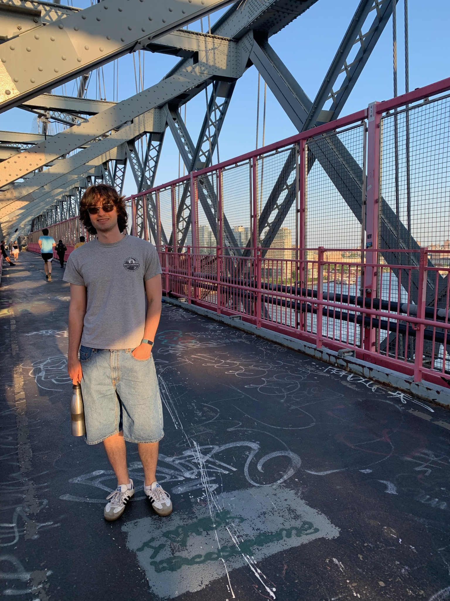

---
# Feel free to add content and custom Front Matter to this file.
# To modify the layout, see https://jekyllrb.com/docs/themes/#overriding-theme-defaults

layout: default
title: About me
---

<h1> Hi, I'm Max Frankel! </h1>

{: .center style="float: right" width="25%"}

I'm an aspiring physicist from New York City and currently a PhD student at CU Boulder. 

I am interested in everything Atomic/Molecular/Optical physics, particularly spectroscopy, ultracold atoms, microscopy, and spatial light modulators.

<h2> Overview of my academic background </h2>

I graduated in 2022 with a BS in physics and a specialization in optics from Stony Brook University. In my last two years at Stony Brook, I worked in the [Ultracold Quantum Systems Group](http://ultracold.physics.sunysb.edu/) under Professor Dominik Schneble.

For the 2022-2023 academic year, I worked in Professor Ilaria Testa’s [Optical BioImaging group](https://www.testalab.org/) in Stockholm, Sweden, on a Fulbright research scholarship.

After my year in Sweden, I began my PhD at CU Boulder in [Jun Ye's group](https://jila.colorado.edu/yelabs) at JILA. I'm working on Sr2, one of the three Strontium atomic clock project in Ye's group.

{: .center style="float: left" width="25%"}
{: .center style="float: center" width="25%"}
{: .center style="float: right" width="40%"}